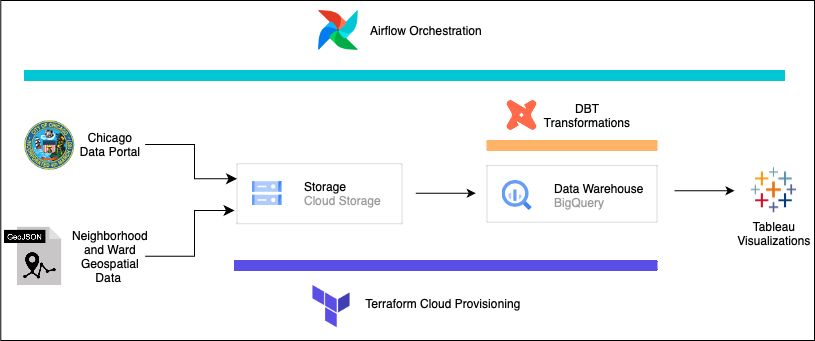
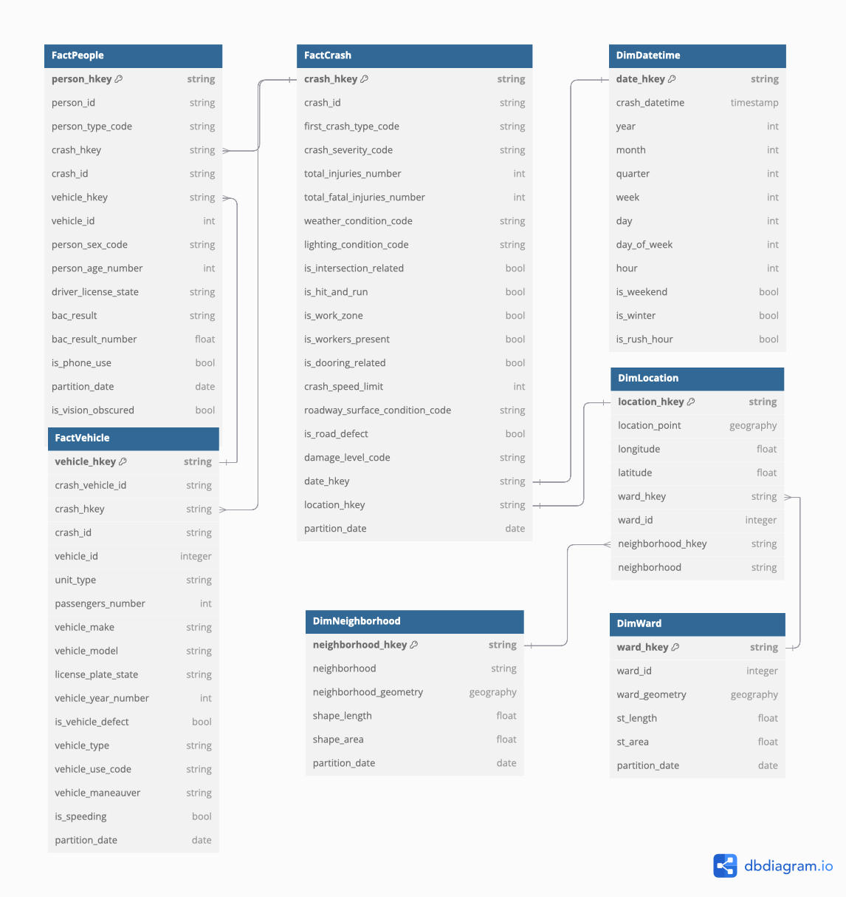
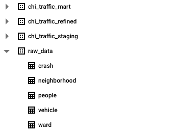
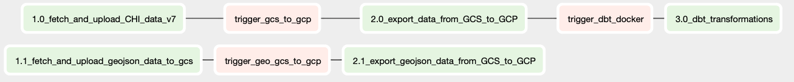
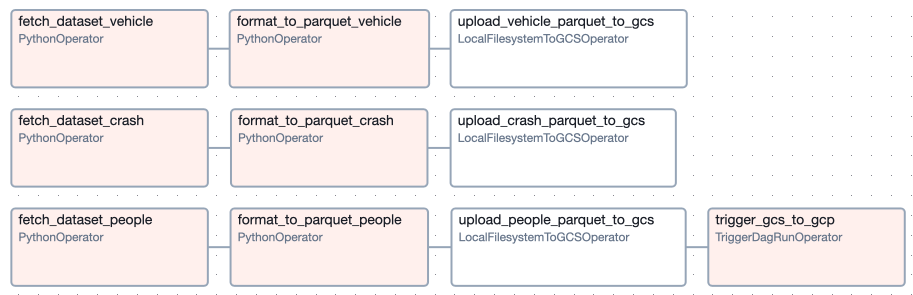
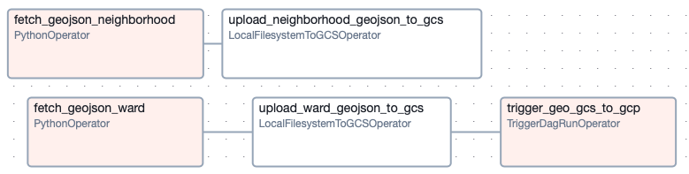
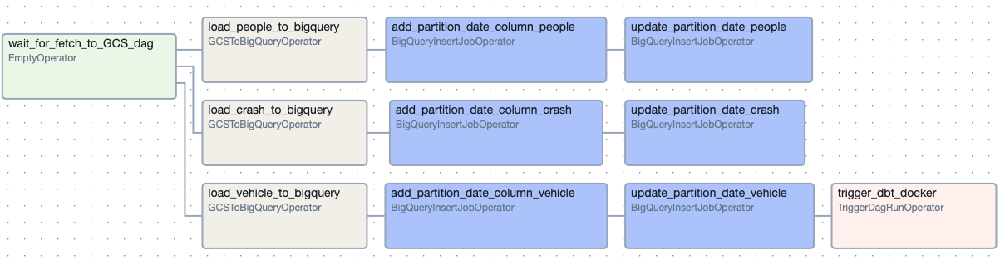
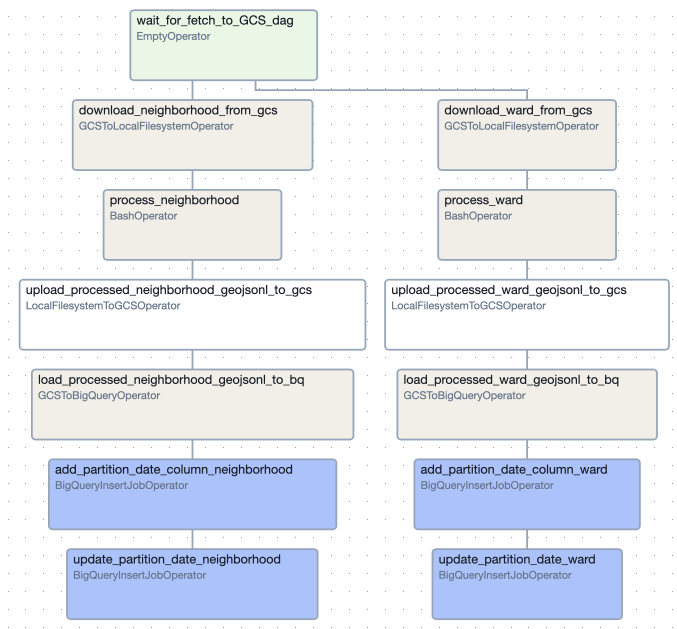
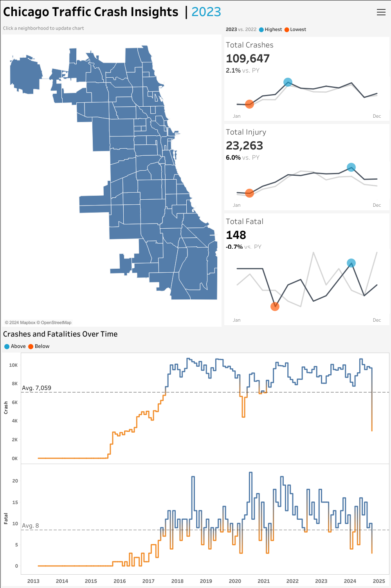
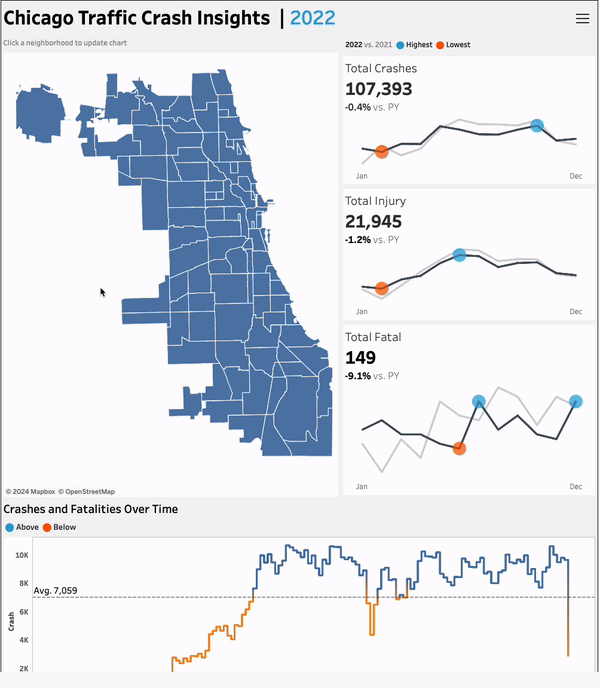

# Chicago Traffic Crash Analytics Pipeline

> End-to-end data engineering pipeline processing 4.6M+ rows of Chicago traffic crash and geospatial data — orchestrated with Apache Airflow, stored in Google Cloud Storage, modelled in BigQuery with dbt, and visualised in Tableau.

**Author:** [Anshul Chaudhary](https://github.com/morid648)

**Stack:** Apache Airflow · Google Cloud Storage · BigQuery · dbt · Terraform · Docker · Python · Tableau

**Live Dashboard:** [View on Tableau Public](https://public.tableau.com/shared/5BNTZ4Q3G?:display_count=n&:origin=viz_share_link)

---

## Table of Contents
1. [Overview](#overview)
2. [Key Capabilities](#key-capabilities)
3. [Architecture](#architecture)
4. [Data Model](#data-model)
5. [Functional Data Engineering Approach](#functional-data-engineering-approach)
6. [ETL Flow](#etl-flow)
7. [Dashboard](#dashboard)
8. [Repository Structure](#repository-structure)
9. [Setup & Prerequisites](#setup--prerequisites)
10. [Infrastructure Provisioning](#infrastructure-provisioning)
11. [Running the Pipeline](#running-the-pipeline)

---

## Overview

This project builds a production-style data engineering pipeline for Chicago's publicly available traffic crash data. Raw crash, vehicle, and people records are fetched weekly from the Chicago Data Portal SODA API, landed in Google Cloud Storage as Parquet files, loaded into BigQuery, transformed through a three-layer dbt model (Staging → Refined → Mart), and surfaced in a Tableau dashboard tracking crash trends, severity, and geographic distribution.

Geospatial boundary data (neighbourhood and ward polygons) follows a parallel path — fetched as GeoJSON, converted to newline-delimited GeoJSON, and joined with crash data in dbt to enable location-based analysis.

---

## Key Capabilities

| Capability | Implementation |
|---|---|
| Weekly automated ingestion | Apache Airflow DAGs with TriggerDagRunOperator chaining |
| Cloud data lake | Google Cloud Storage — Parquet for traffic data, GeoJSONL for geospatial |
| Functional / snapshot-based loading | Full snapshot per run with `partition_date` column; BigQuery always has full history |
| SQL transformation | dbt three-layer model: Staging → Refined → Mart (star schema) |
| Data validation | dbt tests — `not_null`, `unique`, referential integrity, custom `unique_id_partition` |
| Geospatial enrichment | GeoJSON → NDJSON conversion; BigQuery GEOGRAPHY columns; neighbourhood and ward joins |
| Infrastructure as code | Terraform provisions GCS bucket, BigQuery dataset, Cloud Composer, service accounts |
| Containerised dbt | dbt runs inside a Docker container triggered by Airflow's DockerOperator |
| Dashboard | Tableau connected to BigQuery via service account |

---

## Architecture



The pipeline is composed of five chained Airflow DAGs:

```
DAG 01: Fetch Traffic Data → GCS
DAG 02: Fetch Geo Data → GCS         (runs in parallel with DAG 01)
        ↓
DAG 03: GCS → BigQuery (traffic)
DAG 04: GCS → BigQuery (geo)
        ↓
DAG 05: dbt Transformations (Docker)
        ↓
Tableau Dashboard
```

---

## Data Model



The mart layer exposes a star schema with:

**Fact tables:**
- `fact_crash` — one row per crash event (crash_record_id as key)
- `fact_people` — one row per person involved (person_id as key)
- `fact_vehicle` — one row per vehicle involved (crash_unit_id as key)

**Dimension tables:**
- `dim_datetime` — date/time attributes extracted from crash timestamp
- `dim_location` — location attributes enriched with neighbourhood and ward geospatial joins

---

## Functional Data Engineering Approach

This project follows **Functional Data Engineering** principles — all tables are time-partitioned with full snapshots.

- Every pipeline run fetches a **complete snapshot** of the source data and stores it in GCS as Parquet
- When loaded into BigQuery, a `partition_date` column is added corresponding to the ETL run date
- Data is **appended** to BigQuery tables, so the full history of every snapshot is preserved
- dbt models always select **only the latest partition** — so marts reflect the most recent snapshot while all historical states remain queryable for auditability and backfill



---

## ETL Flow

### DAG Dependency Graph


### DAG 01 — Traffic Data: API → GCS
Fetches crash, vehicle, and people datasets from the Chicago Data Portal SODA API → converts CSV to Parquet → uploads to GCS → triggers DAG 03.



### DAG 02 — Geospatial Data: API → GCS
Fetches neighbourhood and ward GeoJSON boundaries from the Chicago Data Portal → uploads to GCS → triggers DAG 04.



### DAG 03 — Traffic Data: GCS → BigQuery
Loads Parquet files from GCS into BigQuery `raw_data` schema → adds `partition_date` column → triggers DAG 05.



### DAG 04 — Geospatial Data: GCS → BigQuery
Downloads GeoJSON from GCS → converts to newline-delimited GeoJSON using `json_to_ndjson.py` → re-uploads to GCS → loads to BigQuery with GEOGRAPHY schema.



### DAG 05 — dbt Transformations
Spins up a Docker container running the dbt project via Airflow's `DockerOperator`. Runs all three dbt layers: Staging → Refined → Mart. A `socat` proxy container enables Docker-from-Docker by bridging the Docker socket.

---

## Dashboard





The Tableau dashboard connects to BigQuery via a dedicated service account (provisioned by Terraform) and provides:
- Crash trends over time
- Severity and injury type breakdowns
- Geographic distribution by neighbourhood and ward
- Contributing cause and weather condition analysis

[View live on Tableau Public →](https://public.tableau.com/shared/5BNTZ4Q3G?:display_count=n&:origin=viz_share_link)

---

## Repository Structure

```
chicago-traffic-crash-pipeline/
│
├── README.md
├── LICENSE
├── CHANGELOG.md
├── CONTRIBUTING.md
├── .gitignore
├── requirements.txt                   ← Root Python dependencies
├── PROJECT_REFERENCE.md               ← Resume bullets and interview prep
│
├── airflow/                           ← Airflow orchestration
│   ├── Dockerfile                     ← Custom Airflow image
│   ├── docker-compose.yaml            ← Local Airflow environment
│   ├── requirements.txt               ← Airflow Python dependencies
│   ├── dags/
│   │   ├── dag_01_traffic_data_to_gcs.py        ← Fetch crash/vehicle/people → GCS
│   │   ├── dag_02_geo_data_to_gcs.py            ← Fetch neighbourhood/ward GeoJSON → GCS
│   │   ├── dag_03_traffic_gcs_to_bigquery.py    ← Load traffic Parquet → BigQuery
│   │   ├── dag_04_geo_gcs_to_bigquery.py        ← Process GeoJSON → BigQuery
│   │   └── dag_05_dbt_transformations.py        ← Run dbt via Docker container
│   └── scripts/
│       └── json_to_ndjson.py                    ← GeoJSON → newline-delimited GeoJSON
│
├── dbt/                               ← dbt transformation project
│   └── chi_traffic_crash/
│       ├── dbt_project.yml
│       ├── packages.yml
│       ├── models/
│       │   ├── sources.yaml           ← BigQuery source definitions + tests
│       │   ├── staging/               ← Raw source views (5 models)
│       │   ├── refined/               ← Cleaned, partitioned incremental models (8 models)
│       │   └── mart/                  ← Star schema: 2 dims + 3 facts (5 models)
│       ├── macros/
│       │   ├── convert_to_boolean.sql
│       │   └── string_empty_to_null.sql
│       └── tests/
│           └── generic/
│               └── unique_id_partition.sql   ← Custom test: unique within partition
│
├── docker/                            ← Docker images for dbt and socat proxy
│   ├── dbt.Dockerfile
│   └── socat.Dockerfile
│
├── terraform_infra/                   ← Infrastructure as code (GCP)
│   ├── main.tf                        ← GCS, BigQuery, Cloud Composer, service accounts
│   └── variables.tf                   ← All configurable values (update before applying)
│
├── tableau/
│   └── workbooks/
│       └── chi_crash_insights.twb     ← Tableau workbook (requires BigQuery connection)
│
└── images/                            ← Architecture and flow diagrams
```

---

## Setup & Prerequisites

### Required
- Google Cloud Platform account with billing enabled
- Terraform ≥ 1.0
- Docker Desktop
- Python 3.10+
- dbt-bigquery
- Tableau Desktop (to open `.twb` file)

### GCP Setup
1. Create a GCP project and note its project ID and project number
2. Enable APIs: BigQuery, Cloud Storage, Cloud Composer, IAM
3. Create a service account for Airflow with roles: Storage Admin, BigQuery Admin, Composer Worker
4. Download the service account key JSON file

---

## Infrastructure Provisioning

```bash
cd terraform_infra
```

Edit `variables.tf` — replace all `<placeholder>` values with your actual GCP project ID, project number, and credentials path.

```bash
terraform init
terraform plan
terraform apply
```

Terraform provisions:
- GCS bucket for data lake storage
- BigQuery dataset (`chi_traffic_dataset`)
- Cloud Composer environment (managed Airflow)
- Composer service account + IAM roles
- Tableau service account + BigQuery read-only roles
- Tableau service account key (written to `tableau/secrets/`)

---

## Running the Pipeline

### Local Airflow (development)

```bash
cd airflow
```

Update `docker-compose.yaml` — set the volume mount path for your GCP service account key.

```bash
docker compose up -d
```

Access Airflow UI at `http://localhost:8080`.

Set these Airflow environment variables / connections:
- `AIRFLOW_CONN_GOOGLE_CLOUD_DEFAULT` — path to your GCP service account key
- `DBT_PROJ_DIR` — absolute path to `dbt/chi_traffic_crash/`
- `DBT_CONFIG_PATH` — path to your dbt profiles directory
- `DBT_GCP_KEY` — path to your dbt GCP service account key

Trigger DAGs manually in order: 01 → 02 → 03 → 04 → 05 (or trigger 01 and 02, which auto-chain to the rest).

### dbt Only

```bash
cd dbt/chi_traffic_crash
dbt run
dbt test
```

---

## License

Licensed under the [MIT License](LICENSE).
